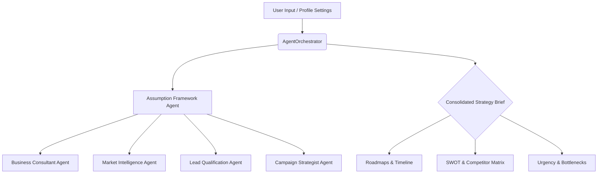

# MarketMind AI — Sales & Marketing Intelligence Platform

> **Generative AI-Powered** enterprise sales and marketing intelligence platform leveraging Groq's LLaMA models for real-time campaign generation, pitch creation, lead scoring, market analysis, and business insights. Driven by a multi-agent orchestrated architecture, it provides deep strategic briefs, interactive chat support, and visual media generators.

---

## 🚀 Key Features

| Feature | Description |
|---------|-------------|
| **Campaign Generator** | Multi-channel marketing campaign designer (LinkedIn, Facebook, Email, etc.) featuring content ideas, ad copies, visual vibe suggestions, and editorial calendars. |
| **Sales Pitch Creator** | Craft highly targeted, personalized sales pitches containing elevator pitches, core value propositions, customer pain points, objection handling, and follow-up templates. |
| **Lead Scoring (BANT)** | AI-powered lead qualification using BANT (Budget, Authority, Need, Timeline) parameters, probability mapping, and actionable conversion roadmaps. |
| **Market Analysis** | Market sizing tools (TAM/SAM/SOM), SWOT analysis matrices, target audience profiling, and competitive intelligence databases. |
| **Business Insights** | Multi-stage business diagnostics, bottleneck identification reports, Urgency-Impact matrices, and 30/60/90 day execution roadmaps. |
| **Interactive Chat Assistant** | Specialized domain chat assistants (Marketing, Sales, General) built on top of chat histories for quick on-the-spot strategy brainstorming. |
| **Ad Poster Maker** | Visual description prompt generator paired with direct Pollinations AI / Flux model integration for high-quality marketing graphics. |
| **Logo Maker AI** | Instantly design modern logo concepts and store vector/base64 history in the database. |
| **PPTX / Strategy Exporter** | Export strategic dashboards and multi-agent report briefs directly into custom presentation slide decks (`.pptx`). |

---

## 🛠 Tech Stack

- **Backend:** Flask (Python 3.12)
- **AI Orchestration:** LangChain, LangGraph (workflow management)
- **AI Models:** Groq Console API (LLaMA-3.3-70B Versatile, LLaMA-3-8B Instant)
- **Frontend:** React 18, Vite, Tailwind CSS, Framer Motion
- **Visualizations:** Chart.js, Recharts, Lucide Icons
- **Database:** SQLite (local development) / PostgreSQL (production compatible)

---

## 🤖 Multi-Agent Architecture

MarketMind AI implements a hierarchical **AgentOrchestrator** model which coordinates specialized analytical agents to generate standard business briefs:



1. **Campaign Strategist:** Suggests visual vibes, headlines, CTAs, and plans multichannel touchpoints.
2. **Lead Qualification Agent:** Scores leads on BANT criteria and suggests qualification playbooks.
3. **Market Intelligence Agent:** Profiles TAM/SAM/SOM, estimates target benchmarks, and assesses competitors.
4. **Business Consultant:** Reviews business models, runs growth simulations, and drafts the 30/60/90 day roadmap.
5. **Sales Agent:** Prepares sales messaging, objection handling scripts, and value hooks.

---

## 📁 Project Structure

```
MARKET-AI/
├── backend/
│   ├── agents/               # Specialized multi-agent logic
│   │   ├── base.py           # Core LLM prompt structures
│   │   ├── business_consultant.py
│   │   ├── campaign_strategy.py
│   │   ├── lead_qualification.py
│   │   ├── market_intelligence.py
│   │   └── sales_agent.py
│   ├── app.py                # Flask main router & endpoints
│   ├── database.py           # Database models, migrations, & seeding
│   ├── orchestrator.py       # Orchestrates sequential business reports
│   ├── prompt_templates.py   # System instruction templates
│   ├── report_generator.py   # Multi-agent brief generators
│   ├── schemas.py            # Pydantic validation schemas
│   └── requirements.txt      # Python dependencies
├── frontend/
│   ├── src/
│   │   ├── components/       # Auth, ChatAssistant, GlassCard, Layout
│   │   ├── pages/            # Dashboard, Profile, LogoMaker, CampaignGenerator, etc.
│   │   ├── App.jsx           # Route router & global context
│   │   └── index.css         # Styling system & custom glassmorphism design
│   ├── package.json          # Node dependencies
│   ├── vite.config.js        # Vite settings & dev proxy rules
│   └── tailwind.config.js    # Tailwind layout overrides
├── marketmind.db             # SQLite database file
├── GOOGLE_LOGIN_INSTRUCTIONS.md # Production OAuth configurations
└── README.md                 # Project documentation
```

---

## ⚡ Quick Start

### Prerequisites
- Python 3.12+
- Node.js 18+
- Groq API Key (Register at [console.groq.com](https://console.groq.com))

### 1. Configure API Keys & Environment
Create a `.env` file in the project root directory:

```env
GROQ_API_KEY=your_groq_api_key_here
SECRET_KEY=change_this_to_something_secure

# Optional: Google OAuth Configuration
GOOGLE_CLIENT_ID=your_google_client_id
GOOGLE_CLIENT_SECRET=your_google_client_secret
GOOGLE_DISCOVERY_URL=https://accounts.google.com/.well-known/openid-configuration
```

### 2. Set Up Python Backend
Recreate and configure the Python virtual environment:

```bash
# Go to workspace root
cd MARKET-AI

# Create virtual environment
python -m venv backend/venv

# Activate virtual environment
# Windows:
backend\venv\Scripts\activate
# macOS/Linux:
source backend/venv/bin/activate

# Install dependencies
pip install -r backend/requirements.txt

# Start the Flask backend
python backend/app.py
```
The Flask backend will launch at [http://localhost:5000](http://localhost:5000) and automatically configure the database schema in `marketmind.db`.

### 3. Set Up React Frontend
Open another terminal pane:

```bash
# Go to frontend folder
cd MARKET-AI/frontend

# Install node dependencies
npm install

# Start Vite development server
npm run dev
```
The React frontend will launch at [http://localhost:5173](http://localhost:5173). Requests starting with `/api` are automatically proxied to the Flask server.

---

## 🔑 Google OAuth 2.0 Configuration
Google Login is supported! Read the step-by-step setup in [GOOGLE_LOGIN_INSTRUCTIONS.md](file:///d:/MARKET-AI/GOOGLE_LOGIN_INSTRUCTIONS.md) to register your app credentials on the Google Cloud Console.
